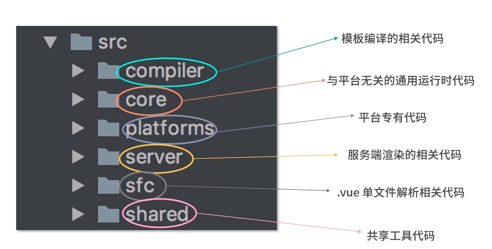
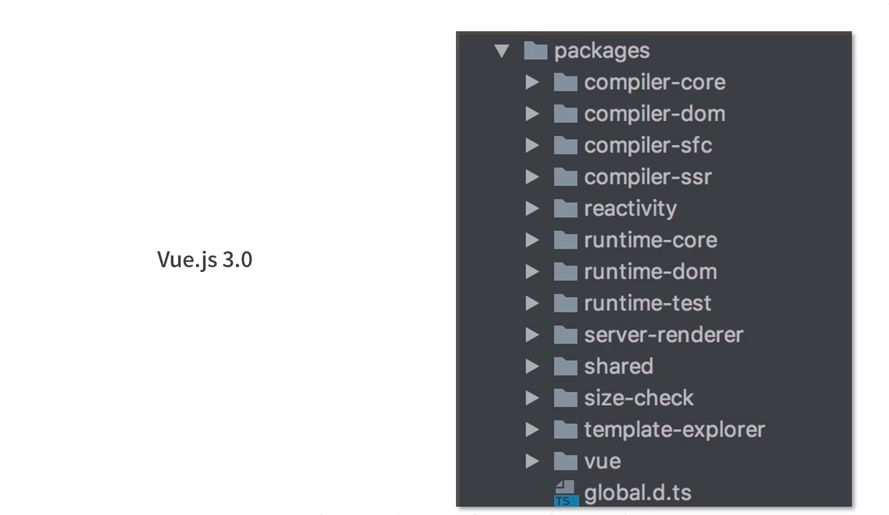
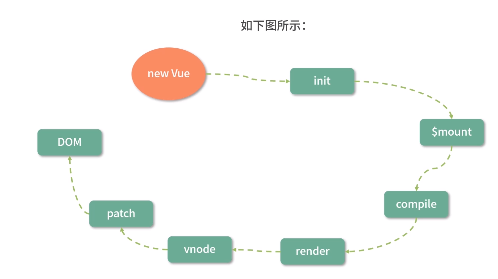
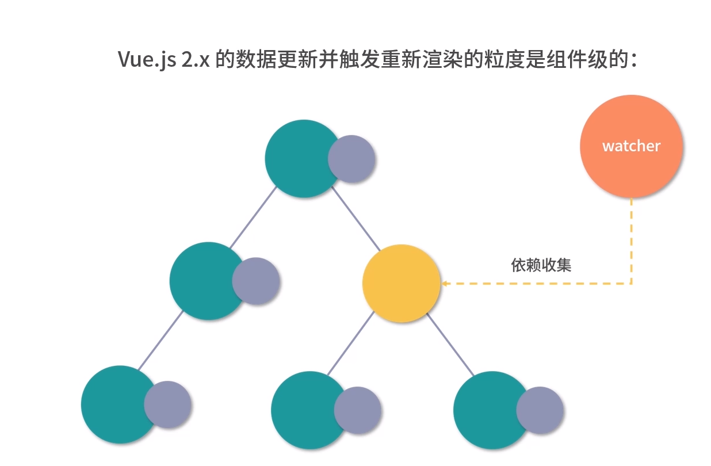
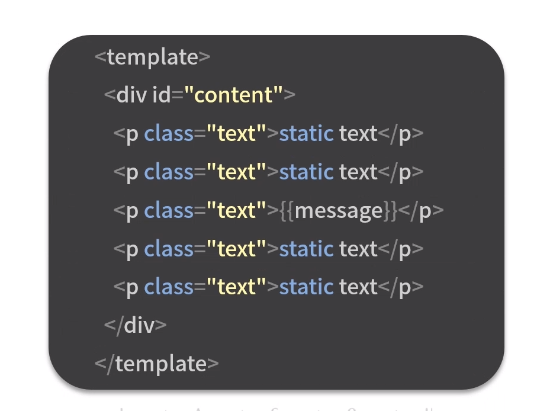
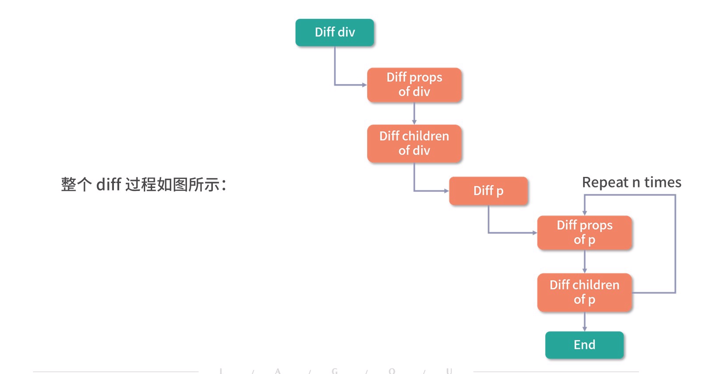
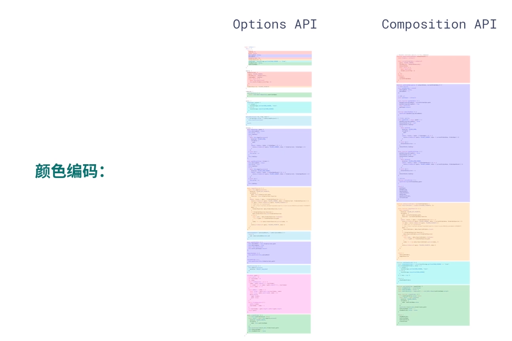

vue2 的痛点
vue2 已经很完美了, 但是还是有一些痛点

1. 源码自身的维护性
2. 数据量大后带来的渲染和更新的性能问题
3. 兼容性

- 想舍弃但为了兼容性一直保留的鸡肋 API

尤雨溪想带来的

1. 更好的编程体验
2. 更好的 ts 支持
3. 更好的逻辑复用实践
   所以可以从, 源码, 性能, api 三个方向上优化框架

vue3 具体带来的优化

1. 源码优化

- 使用 monorepo 和 ts 管理和开发源码, 目标是提升自身代码的可维护性
- vue2 源码组织方式
  
- 

相比较 vue2 的源码组织方式, monorepo 把这些模块拆分到不同的 package 中, 每个 package 有各自的 API, 类型定义和测试

这样使得模块拆分更细化, 职责划分更明确, 模块之前的依赖关系更加明确, 开发人员更容易阅读, 理解好更改所有模块源码, 提高代码的可维护性

monorepo 可以让每个模块都是独立的, 比如用户如果只想使用 vue3 的响应式能力, 那么可以单独依赖这个响应式库, 而不用依赖整个 vue

vue3 减少源码的体积

1. 去除冷门 feature
2. 引入 tree-shaking

vue 从 new Vue 到渲染 dom

所以在性能优化时, 除了优化数据劫持部分, 还可以在耗时较多的 patch 阶段

vue3 在编译时(compile)优化了编译的结果, 实现运行时的 patch 过程的优化

在 vue2 中, 更新的粒度是组件级别的, 在这个需要更新的组件内部, 需要遍历整个 vnode 树

比如我们有一个这样的组件

如果 message 更新了, 整个 diff 过程会是

可以看出, 在单个组件内部, 需要遍历整个 vnode 树, 像上面的组件, 只是 message 变化, 没有变化的另外 4 个 p 标签也会被遍历, 这样更新组件就跟组件的元素个数相关, 而不是跟组件的动态结点相关, 这样会浪费很多时间, diff 没用的结点

vue3 使用了 block tree(将模板基于动态结点指令切割的嵌套区块, 每个区块内部结点的结构是固定的, 每个区块只需要以一个 Array 来追踪自身包含的动态结点), 借助 Block Tree, vue3 将 vnode 更新性能由与模块整体大小相关提升为与动态内容的数量相关

vue3 优化了逻辑组织(composition api)

vue2 中编写组件本质就是在编写一个包含了描述组件选项的对象, 我们称之为 Options API, 这种方式在写法上非常符合直觉思维, 新手开发起来理解容易, 上手快. 缺点是在开发比较大的组件时, 新增一个功能点, 需要上下跳动的幅度比较大(因为 data, methods 等在不同的位置), 还有就是代码的复用比较麻烦, 使用 mixin(1, 命名冲突, 因为每个 mixin 与其它 mixin 都是无感的, 所以属性名称很容易冲突, 2, 如果有多个 mixin, 那么方法来自哪一个 mixin, 就变得不清晰)

composition api 可以将功能点抽离出来,

1. 写在同一个函数中, 有益于组织代码和代码复用
2. 因为都是函数调用, 可以有更好的类型推导
3. 有益于 tree-shaking

