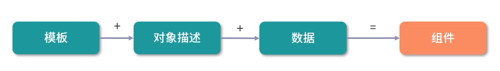

# 组件

组件系统是 vue 的一种重要概念, 它是一种对 dom 结构的抽象, 使用小型, 独立和通常可复用的组件构建大型项目

整个 HTML 页面都可以分为(粒度不同, 越基础的组件, 粒度越小)

- HTML 标签组成的 dom 树
- 像 elementui, antd 等基础库或者业务库组成的基础组件树
- 自己编写的更加高级的组件树

组件化时 vue 的核心思想之一, 它允许我们用模板加对象描述的方式去创建一个组件, 再 加上我们给组件注入不同的数据, 就可以完整地渲染出组件

当数据更新后, 组件可以自动重新渲染, 因此用户只需要专注于数据逻辑的处理, 而无需关心 dom 的操作, 无论是开发体验和开发效率都得到了很大提升
