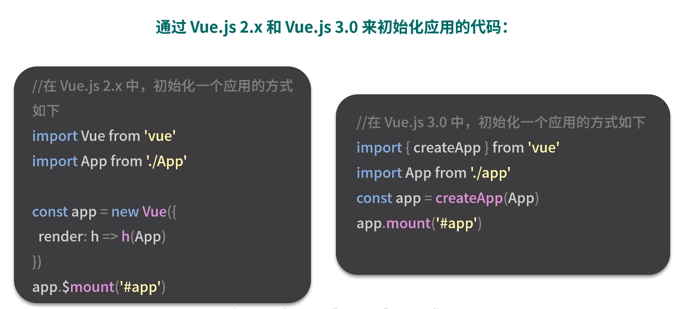
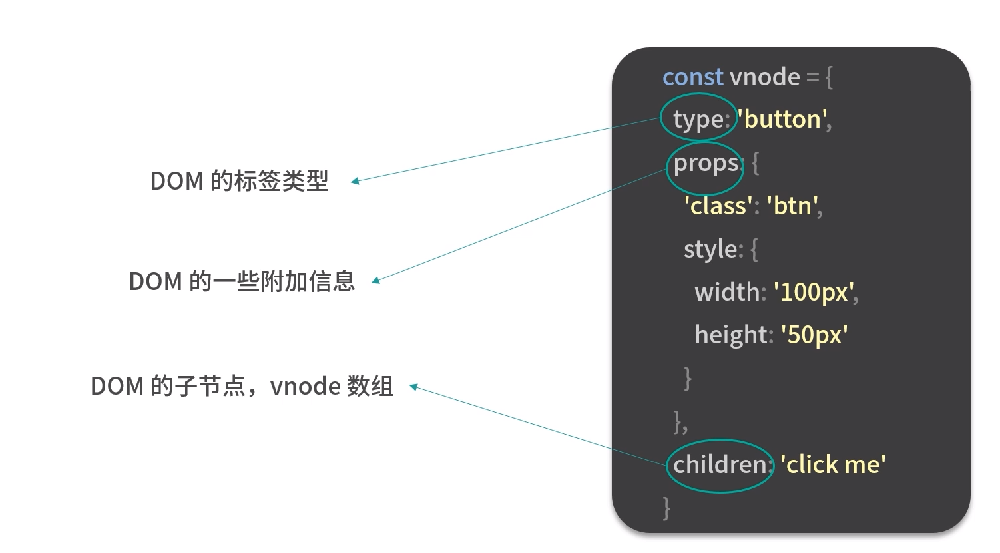
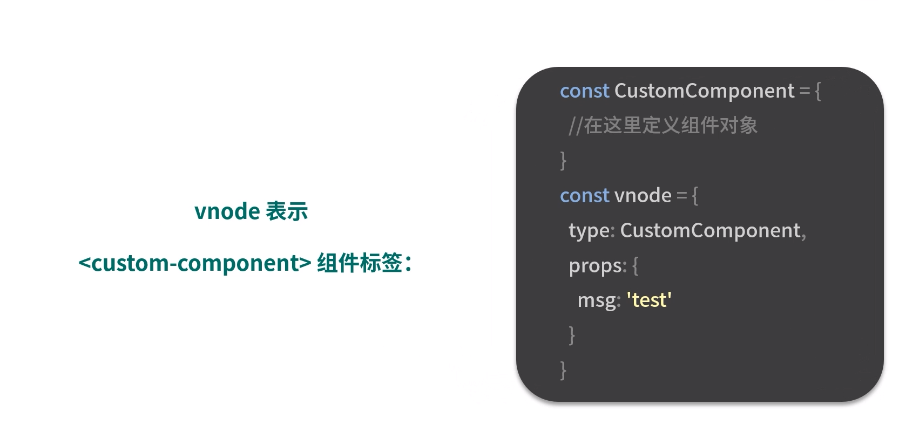

# 组件

首先, 组件是一个抽象的概念, 它是对一棵 dom 树的抽象, 例如我们在页面中写一个组件结点

```html
<hello-world></hello-world>
```

这段代码具体会渲染成什么, 取决于你怎么编写 HelloWorld 组件的模板.

```html
<template>
  <div>
    <p>Hello World</p>
  </div>
</template>
```

所以从表现上来看, 组件的模板决定了组件生成的 dom 标签, 而在 Vue 内部, 一个组件想要真正的渲染生成 DOM, 还需要经历'创建 vnode-渲染 vnode-生成 dom'这几个步骤


> 这里需要理解深一点, 根组件开始, 一直重复这个过程, 创建vnode, 渲染vnode, 生成dom
>
> 组件的话, 会通过render函数, 生成vnode, 然后进入patch, 会细粒度到元素, 这时才会直接生成dom

# 应用程序初始化

一个组件可以通过"模板加对象描述"的方式创建, 组件创建好之后, 是怎么被调用并初始化的呢

因为整个组件树是从根组件开始渲染的, 所以我们需要从应用程序的初始化过程开始分析



vue3 和 vue2 初始化应用的方式差不多, 本质上都是把 App 组件挂载到 id 为 app 的 dom 上

# vnode

vnode 本质上是用来描述 dom 的 js 对象, 它在 vue 中可以描述不同类型的结点, 比如普通元素结点, 组件结点等

- 普通元素结点(vnode)



- 组件结点(vnode)



## vnode 的优势

- 抽象

引入 vnode, 可以将渲染过程抽象化, 从而使得组件的抽象能力也得到提升

- 跨平台

因为 patch vnode 的过程在不同平台可以有自己的实现, 基于 vnode 再做服务端渲染, weex 平台, 小程序平台的渲染都变得简单

使用 vnode 可以提升操作 dom 的性能, 但是并不能提升整体应用的性能

- 可以提升操作 dom 的性能, 是因为, 它经过 diff 之后, 可以找到最小的操作 dom
- 不能提升整体应用的性能, 是因为, 它在 render to vnode 需要性能消耗, 它有 diff 过程, 如果 diff 过程很复杂, 但是操作 dom 的过程却很简单, 那么, 有可能是影响整个应用的性能的

## 创建 vnode

通过 createVNode 函数创建 vnode

## 渲染 vnode

通过 render 函数渲染 vnode

patch 在这里,

整个流程

```ts
// 创建 app实例
createApp()
// 挂载dom
=> .mount('#app')
  // 创建 vnode
  => createVNode()
  // 利用渲染器渲染vnode
  render()
    // 创建组件
    => patch()
      // 创建组件
      processComponent()
      // 创建组件
      mountComponent()
        // 创建组件实例
        createComponentInstance()
        // 设置组件实例
        setupComponent()
        // 设置并运行带副作用的渲染函数
        setupRenderEffect()
          // 生成subTree(就是组件中的内容)
          renderComponentRoot()
          // 将subTree挂载到父容器上
          patch() // 到这里就是递归了
```
